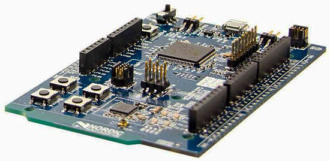
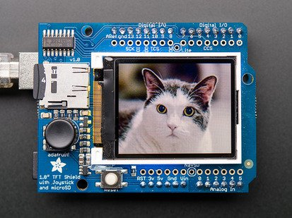
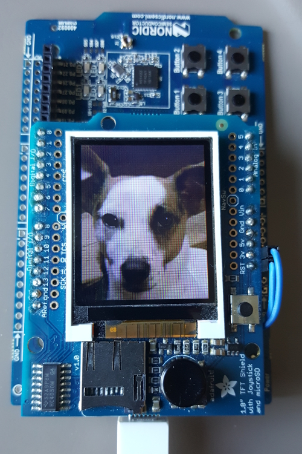

# Bluetooth Remote Control

https://bertrandmartel.github.io/bluetooth-remote-control

[](https://travis-ci.org/bertrandmartel/bluetooth-remote-control)
[](LICENSE.md)

[](https://play.google.com/store/apps/details?id=com.github.akinaru.bleremote)
[](https://drone.io/github.com/bertrandmartel/bluetooth-remote-control/files/android/app/build/outputs/apk/app-debug.apk)

Bluetooth Low Energy remote control based on DK51 board from Nordic Semiconductor with ST7735 1.8 Oled LCD from Adafruit

## Features

* HID Service BLE over GATT for full compatibility with Android TV :
 * keyboard control :
    * up / down / left / right
    * escape (back)
 * consumer control :
    * AC Search
    * AC Home
    * Play/Pause (Android custom keycode) 

* Custom Display Service used to receive a compressed bitmap over GATT :
 * compressed bitmap is stored temporarily on device flash & removed afterward
 * bitmap format is 128*160 fastlz compressed with block of 4096 octet
 * regular characteristic write is used (not long write)

* Android application can be used to test :
 * hid keys notification
 * command led states on DK51 board
 * send a bitmap to be displayed on adafruit OLED module

* works fine on Android / Android TV 

* works on Apple TV but some keycode differ (consumer control)

* this project doesn't implement any Audio Service for Voice Search 

## Mode 1 : Android testing application


## Mode 2 : BLE HID Service mode


You can't combined Mode 1 & Mode 2 simultaneously.

## Project structure

* <b>/firmware</b> - microcontroller code written for NRF DK51 board
* <b>/android</b> - android application to control device

## Hardware setup

* NRF51 DK board 
  * nrf51822 chipset based on an ARM Cortex M0 processor (128kB flash memory / 16kB RAM)



* Adafruit 1.8" Color TFT Shield with Joystick



## Hardware installation



`RST` is linked to `VDD`

## Build

### Get source code

```
git clone git@github.com:bertrandmartel/bluetooth-remote-control.git
cd bluetooth-remote-control
git submodule update --init --recursive
```

### Configuration

* armgcc toolchain
* sofdevice s130
* nRF5 SDK 11.0.0

### Setup / Installation

* follow SDK/Toolchain Installation steps section of <a href="https://gist.github.com/bertrandmartel/a38315c5fe79ec5c8c6a9ed90b8df260#installation-steps">this tutorial</a>

* specify NRF51 SDK directory with :

```
export NRF51_SDK_DIR=/path/to/sdk
```

### Build & flash firmware

```
cd firmware
make
make flash_softdevice
make flash
```

### Build Android App

```
cd android
./gradlew build
```

## External library

### Firmware

* NRF 51 SDK 11.0.0 : https://www.nordicsemi.com/eng/Products/Bluetooth-low-energy/nRF5-SDK
* fastlz compression library : https://github.com/ariya/FastLZ
* Integration of Adafruit OLED ST7735 1.8 display on NRF51 DK board : https://github.com/bertrandmartel/adafruit-oled-st7735-dk51

### Android application

* Android crop image library : https://github.com/lvillani/android-cropimage
* Simple vertical and horizontal color picker : https://github.com/DASAR/ShiftColorPicker
* fastlz compression library : https://github.com/ariya/FastLZ
* appcompat-v7, design & recyclerview-v7

### External links

* USB HID keycode : http://www.freebsddiary.org/APC/usb_hid_usages.php
* Android HID keycode/keyevent mapping : https://source.android.com/devices/input/keyboard-devices.html

## License

The MIT License (MIT) Copyright (c) 2016 Bertrand Martel
